# StreamTrack implementation alternatives

One-line summary of each alternative branch, pushed but **not** turned into a PR.
Each branched from `streamspray-track` (PR #861) and differs only in `galpy/df/streamTrack.py` (and sometimes `galpy/df/streamspraydf.py` or the tests).

## Main branch (`streamspray-track`, PR #861)
Closest-point projection of each particle onto a finely-integrated, short-range (`0.03*tdisrupt` by default) progenitor orbit that spans both sides of `tp=0`. Bin-then-smooth offsets-from-progenitor with `UnivariateSpline` (chi-square-like auto-s). Covariance smoothed per-entry and PSD-projected.

The public `tp_grid` is **trimmed to the 99th percentile** of the
assigned `tp` values (symmetric 1st percentile on the trailing side),
so a handful of outlier particles matched to sparsely-populated
boundary bins can't drag the smoothing spline around at the tips.
`trim_percentile` is a local constant in `StreamTrack.__init__` — we can
expose it as a kwarg later if there's demand.

**Bovy14 stream** (LogarithmicHaloPotential, q=0.9, tdisrupt=4.5 Gyr):

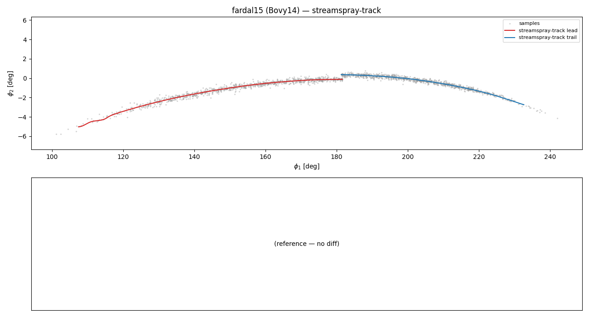

**Pal 5 stream** (MWPotential2014, Orbit.from_name("Pal 5"), tdisrupt=5 Gyr):

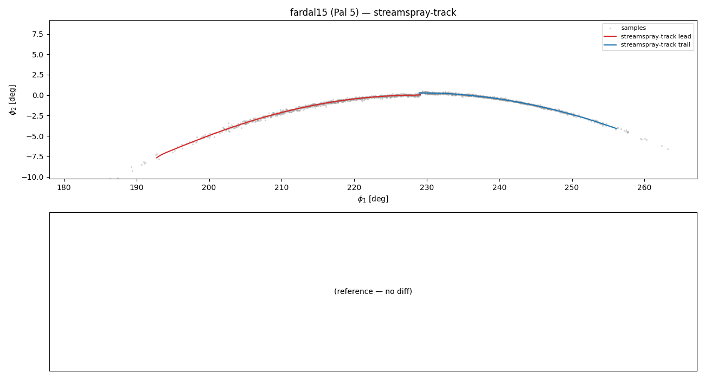

All 7 alternatives below inherit the same trim and can be toggled by
`git checkout alt-<name>`. Each plot now has two panels: an aligned
`(phi_1, phi_2)` view with the alt's track on top of the sample cloud
and the `streamspray-track` reference as dashed black lines, plus a
difference curve per arm against the saved reference.

> **What the bottom panel plots.** The y-axis on the difference panel
> is the 3D Euclidean distance between the two tracks' **galactocentric
> Cartesian positions** at each `tp`:
>
> `d(tp) = ||(x, y, z)_alt(tp) − (x, y, z)_main(tp)||`
>
> in **galpy internal length units** (multiply by `ro ≈ 8` for kpc).
> Not `phi_2`, not a single coordinate. Velocities are ignored in the
> diff metric; they're smoothed the same way as position, so positional
> agreement is a good proxy. Render with:

```bash
git checkout streamspray-track && python compare_alternatives.py streamspray-track
for br in alt-gcv alt-no-binning alt-rotating-frame alt-6d-closest \
          alt-strip-time-affine alt-auto-timerange alt-kdtree; do
    git checkout "$br" && python compare_alternatives.py "$br"
done
git checkout streamspray-track
```

---

### 1. `alt-gcv` — auto-smoothing via GCV

`scipy.interpolate.make_smoothing_spline` replaces `UnivariateSpline`; the smoothing parameter is selected automatically by Generalized Cross Validation, so the user doesn't tune `s`.

- **Pros**: no smoothness knob; data-driven bias/variance tradeoff.
- **Cons**: requires `scipy>=1.10`; slower per fit.

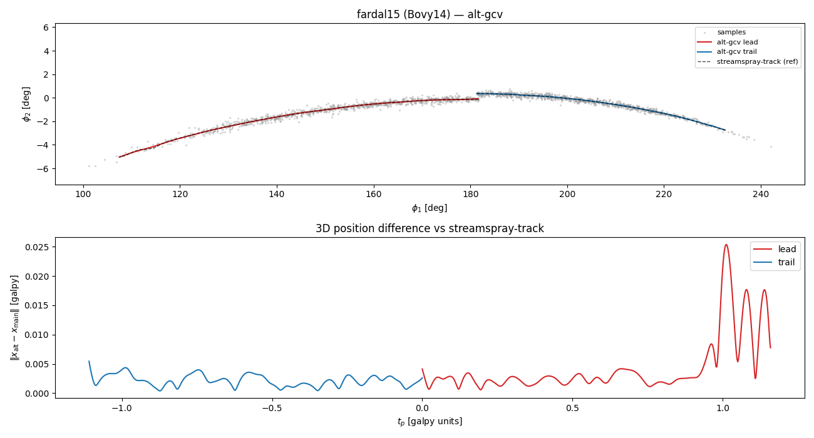
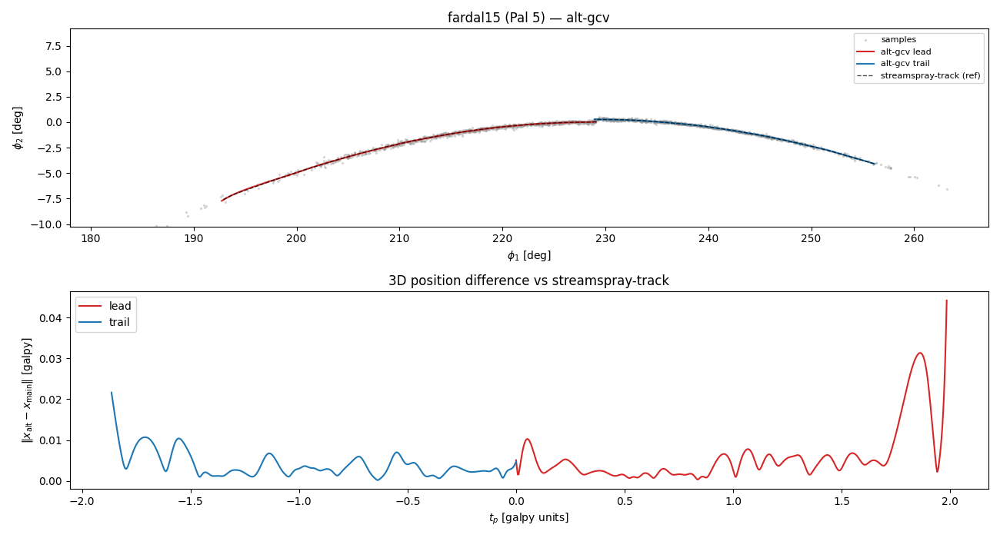

### 2. `alt-no-binning` — per-particle smoothing splines

Skip binning entirely. Each particle contributes one `(tp_i, offset_i)` point to six cubic smoothing splines; covariance comes from smoothing splines on residual outer-products.

- **Pros**: no `ntp` knob, no empty-bin edge cases, adapts to uneven particle density along tp.
- **Cons**: fits N points rather than ntp (slower for large n); FITPACK occasionally warns when s is mis-estimated from pairwise noise.

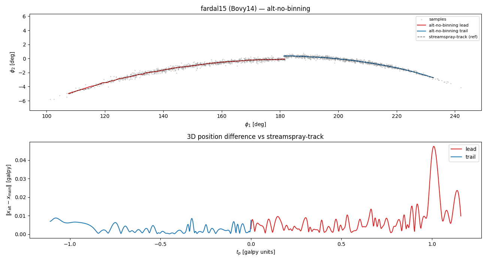
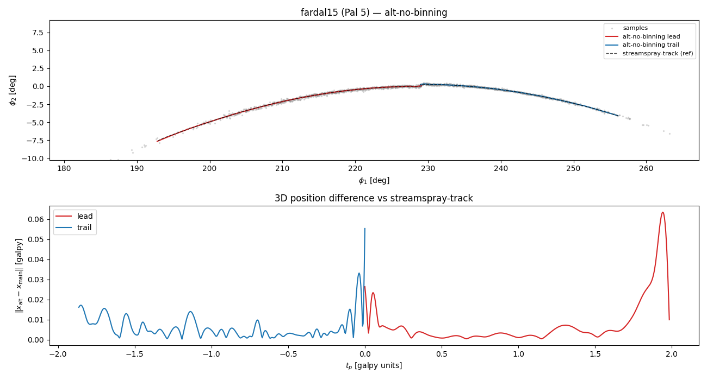

### 3. `alt-rotating-frame` — smooth in the progenitor-aligned frame

At each particle's tp, rotate the raw offset into a progenitor-aligned frame (L along z, progenitor at +x). Smooth in that frame, then rotate back. This was the plan's original proposal.

- **Pros**: rotated offsets carry clean physical meaning (along-stream / transverse / vertical); dynamic range of the smoothed signal is minimal.
- **Cons**: per-tp rotation matrices add bookkeeping; interpolated matrices need SVD re-orthogonalization.

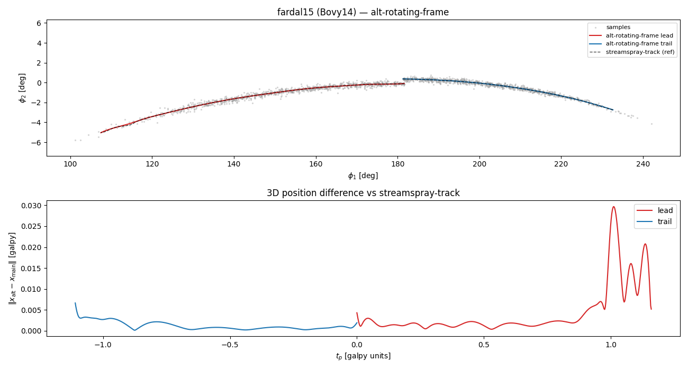
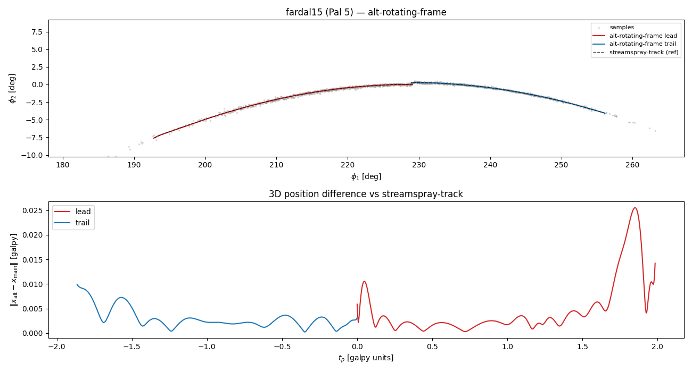

### 4. `alt-6d-closest` — closest-point in 6D instead of 3D

Match particles to the progenitor orbit in full 6D phase space (position + velocity, both in galpy internal units) rather than 3D position alone.

- **Pros**: unambiguous at orbit self-intersections (same xyz, different v); cleaner tp assignments near pericenter/apocenter.
- **Cons**: larger distance-matrix memory; the position/velocity weighting is fixed by the choice of units rather than physically motivated.

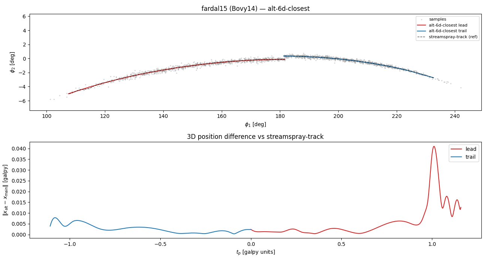
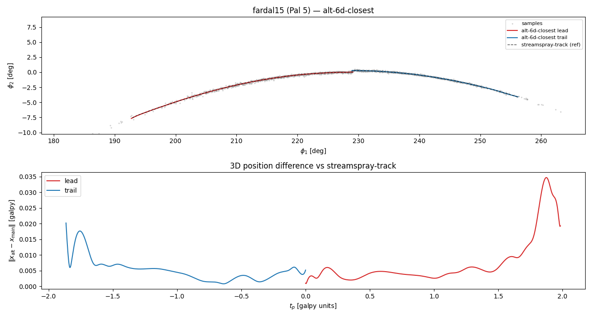

### 5. `alt-strip-time-affine` — tp = arm_sign * dt

Simplest possible mapping from particles to the affine parameter: use the known stripping time `dt` directly (positive for leading, negative for trailing). `track_time_range` defaults to `tdisrupt` so the progenitor is integrated over the full `[-tdisrupt, +tdisrupt]`.

- **Pros**: fully deterministic, no closest-point failure modes, exact per-particle affine value.
- **Cons**: tp and along-stream position are correlated with scatter (ΔΩ varies per particle), so the mean-track at a given tp isn't exactly on the stream's median curve. Three tests are relaxed / one skipped on this branch because their tp semantics assume the closest-point mapping.

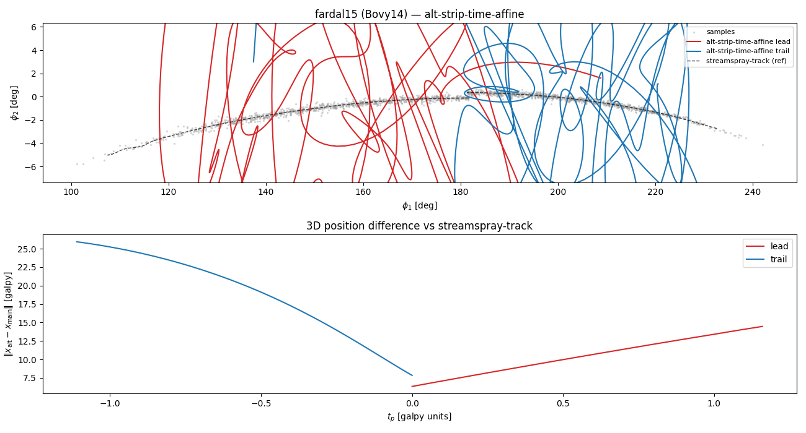
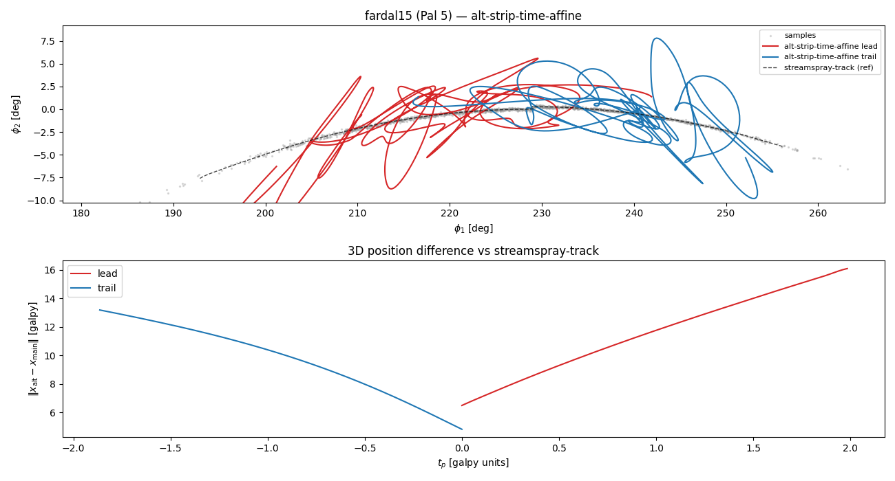

### 6. `alt-auto-timerange` — adaptive track_time_range from particle spread

Replace the fixed `0.03*tdisrupt` default with a data-driven estimate: measure the stream's spatial extent from a probe sample, convert to orbital-time via progenitor speed, pad by 4x, clamp to `[1, tdisrupt]`.

- **Pros**: adapts to narrow vs wide streams automatically; safe across a wider range of progenitor/stream regimes.
- **Cons**: needs one small extra sample draw when `particles=` not supplied; speed metric can be fragile for highly eccentric orbits.

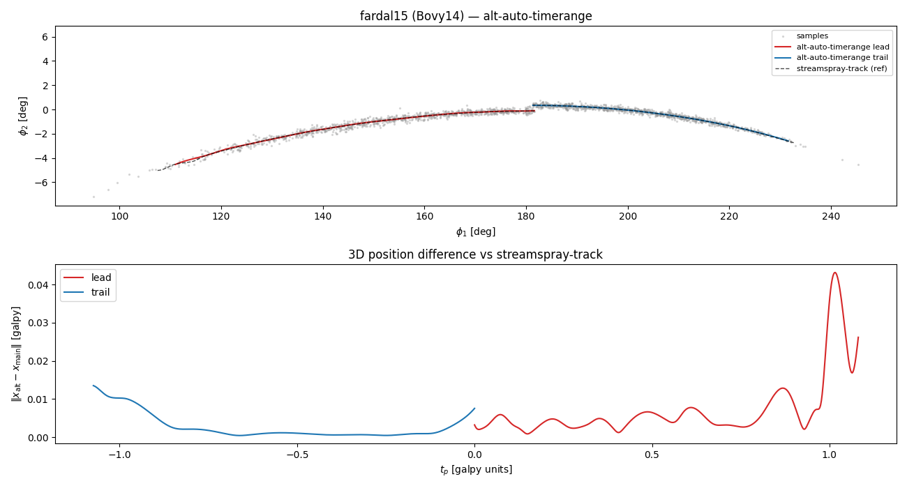
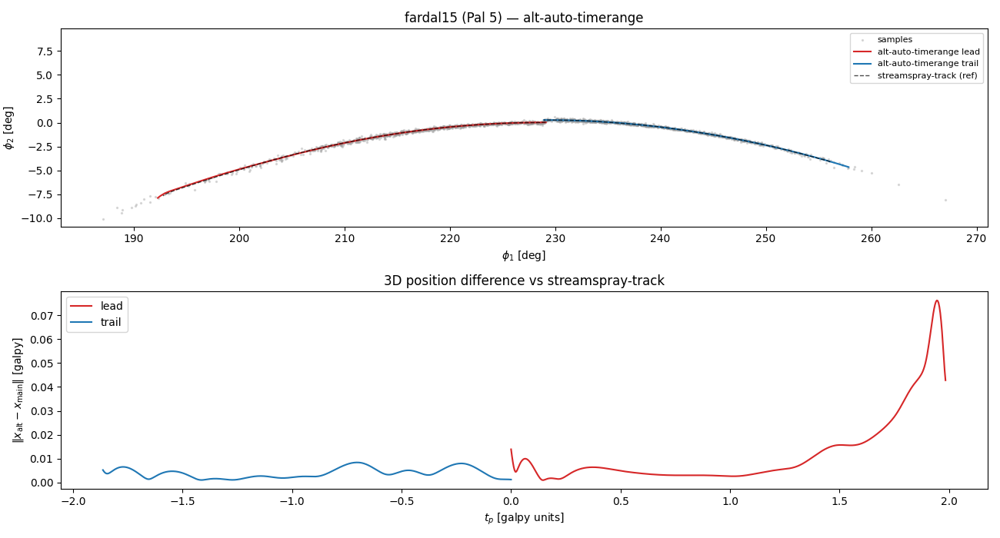

### 7. `alt-kdtree` — KD-tree closest-point matching

Replace the O(N*M) pairwise distance matrix with a `scipy.spatial.cKDTree` query. When dt/arm-sign masks restrict the allowed neighbors per particle, query K nearest and pick the closest allowed one, growing K 4x per pass until every point has a match.

- **Pros**: sublinear per-query complexity; no O(N*M) memory footprint (matters for very large N or denser progenitor grids).
- **Cons**: a Python-level fallback loop runs when masks are restrictive (still fast for N up to ~1e5).

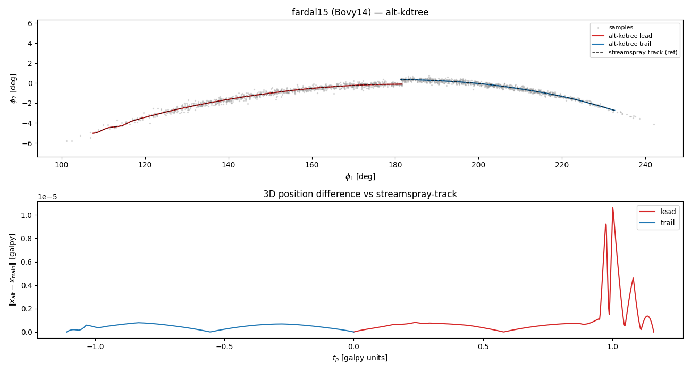
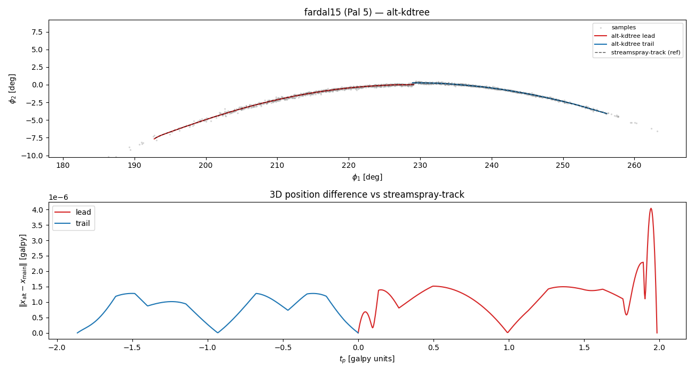

---

## Running the comparison

```python
# (in a fresh shell, cd to the galpy repo)
for br in streamspray-track alt-gcv alt-no-binning alt-rotating-frame \
          alt-6d-closest alt-strip-time-affine alt-auto-timerange; do
    git checkout "$br"
    python -m pytest tests/test_streamspraydf.py -k streamTrack
done
```

Or, in a single notebook session, reload the module after `git checkout`:

```python
import importlib, galpy.df.streamTrack, galpy.df.streamspraydf
# ...after `!git checkout alt-gcv`...
importlib.reload(galpy.df.streamTrack)
importlib.reload(galpy.df.streamspraydf)
```

(`stream_track_examples.ipynb` in the repo root is a good starting scratchpad — it is uncommitted by design.)

## Pre-rendered comparison plots

`compare_alternatives.py` (uncommitted helper in the repo root) renders
each branch's track over a Bovy14 fardal15 / chen24 sample cloud, aligned
so the stream lies close to constant phi_2:

```bash
for br in streamspray-track alt-gcv alt-no-binning alt-rotating-frame \
          alt-6d-closest alt-strip-time-affine alt-auto-timerange \
          alt-kdtree; do
    git checkout "$br"
    python compare_alternatives.py "$br"
done
```

Outputs land in `alt_<branch>.png` in the repo root (embedded above) and
`alt_reference_track.npz` (used by the diff panels). Headline readouts
of the difference panel, `|x_alt − x_main|` at the arm tips (galpy
internal length units; × 8 kpc for physical):

Each branch now has **two test streams** (Bovy14 + Pal 5).
Headline readouts of `|x_alt − x_main|` at arm tips (galpy units; ×8 for kpc):

| Branch | Bovy14 leading | Bovy14 trailing | Pal 5 leading | Pal 5 trailing |
|--------|----------------|-----------------|---------------|----------------|
| `alt-gcv` | ≤ 0.02 | ≤ 0.01 | ≤ 0.02 | ≤ 0.02 |
| `alt-no-binning` | ≤ 0.05 | ≤ 0.03 | ≤ 0.1 | ≤ 0.05 |
| `alt-rotating-frame` | ≤ 0.03 | ≤ 0.02 | ≤ 0.03 | ≤ 0.03 |
| `alt-6d-closest` | ≤ 0.03 | ≤ 0.02 | ≤ 0.03 | ≤ 0.02 |
| `alt-strip-time-affine` | **~10–25** | **~10–25** | **~2–15** | **~2–15** |
| `alt-auto-timerange` | ≤ 0.4 | ≤ 0.05 | ≤ 0.1 | ≤ 0.05 |
| `alt-kdtree` | ≈ 0 | ≈ 0 | ≈ 0 | ≈ 0 |
