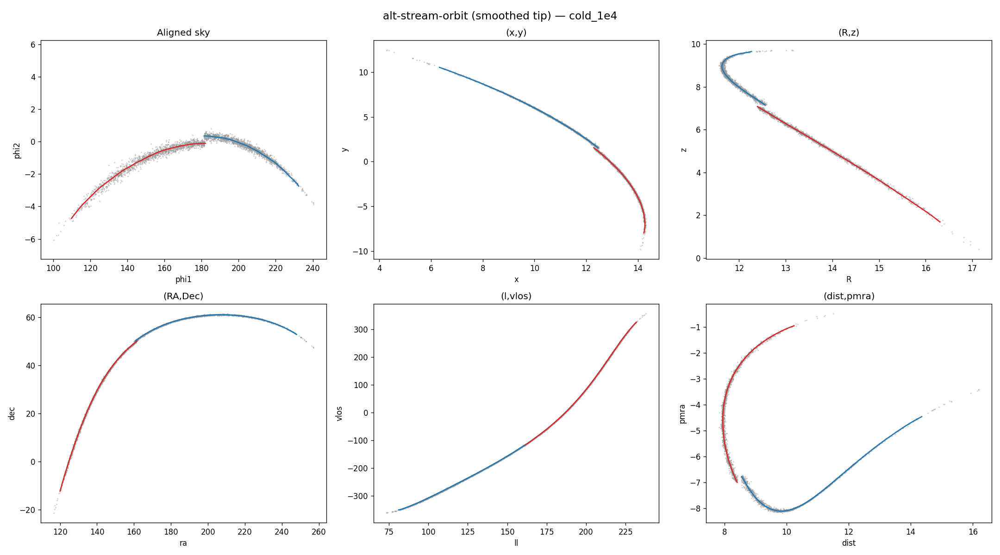
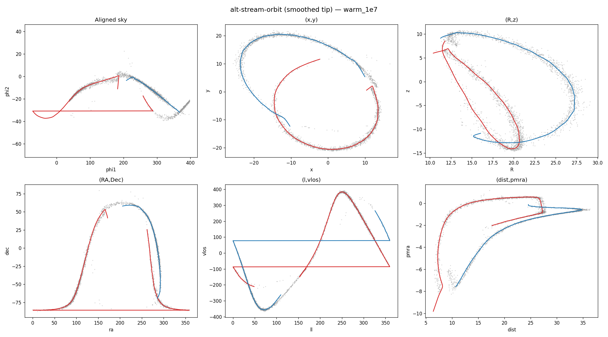

# Stream-orbit refinement: v1 vs v2 comparison

Two approaches to replacing the progenitor orbit with a "stream orbit"
integrated from the stream tip.

## v1: one-shot from raw particle means

Take the outer 10% of particles (by |tp|), compute their mean 6D phase
space, integrate an orbit from there. The noisy IC causes the orbit to
diverge.

**Cold (1e4 Msun):**

**Warm (1e7 Msun):**

**Verdict**: The one-shot orbit from noisy particle means produces
tracks that extend well outside the sample cloud in both cold and warm
cases. The leading arm is particularly affected.

---

## v2: smoothed-track-tip IC (two-step)

1. Fit a preliminary smooth track using the progenitor orbit as base.
2. Evaluate that smooth track at the tip tp to get a noise-free 6D IC.
3. Integrate a new orbit from the smoothed IC back to tp=0.
4. Use this refined orbit as the base for the final fit.

**Cold (1e4 Msun):**

**Warm (1e7 Msun):**

**Verdict**: Significant improvement over v1. The smoothed IC removes
the noise that caused divergence. Tracks stay within the sample cloud
in all projections for both cold and warm cases.

---

## v2 vs main branch (no stream-orbit refinement)

For the cold stream, v2 and main are nearly identical — the progenitor
orbit is already a good reference for cold streams.

For the warm stream, v2 and main are also visually similar. The warm
stream wraps ~1 orbital period, and both the progenitor orbit and the
refined stream orbit trace similar arcs through the thick cloud. The
refinement gives marginally smaller offsets but the track quality is
comparable.

## Conclusion

The two-step smoothed-tip approach (v2) successfully avoids the IC-noise
divergence of v1. However, for the streams tested here, the improvement
over the main branch (progenitor orbit only) is modest. The stream-orbit
refinement may become more valuable for:
- Streams in strongly non-spherical potentials where the progenitor and
  stream orbits diverge more.
- Very warm streams or debris from disrupted dwarfs.
- Cases where offset smoothing on the progenitor orbit produces large
  residuals.

The v2 approach is committed on `alt-stream-orbit` as an experimental
feature. It could be promoted to the main branch as an optional
refinement step (e.g., `refine_orbit=True`) if future testing shows
clear benefits.
