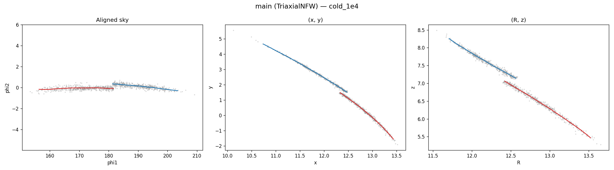
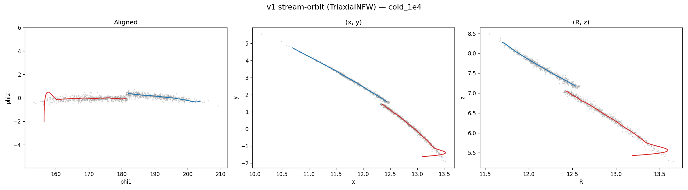
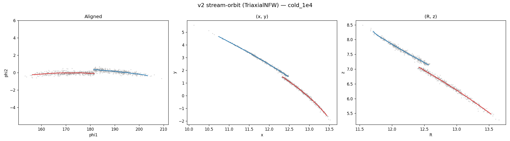
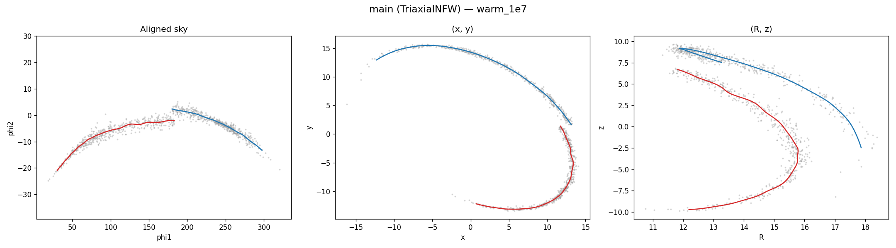
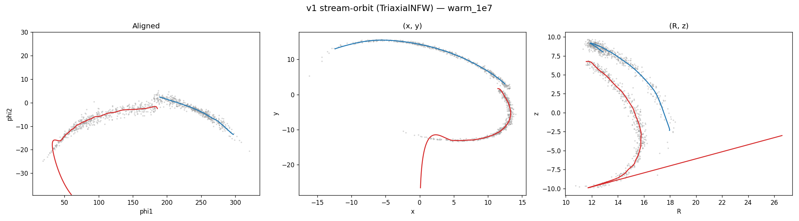
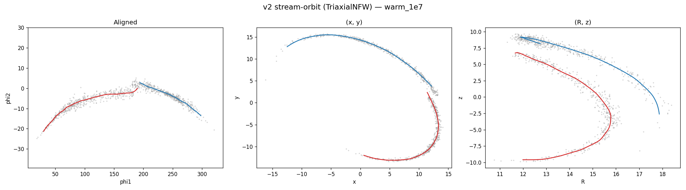

# Triaxial NFW comparison: main vs v1 vs v2

TriaxialNFWPotential(normalize=1, a=20/8, b=0.8, c=0.6), Bovy14 orbit,
tdisrupt=2 Gyr, n=1000 particles. Three projections: aligned sky, (x,y),
(R,z).

## Cold stream (10^4 Msun)

### Main (progenitor orbit, no stream-orbit refinement)

### v1 (one-shot orbit from raw particle-mean tip IC)

### v2 (two-step orbit from smoothed track tip IC)

**Cold-stream verdict**: All three are nearly identical. The cold stream
stays close to the progenitor orbit even in a triaxial potential, so the
stream-orbit refinement has negligible effect. v1's noisy IC doesn't
diverge here because the cold tip is well-determined.

---

## Warm stream (10^7 Msun)

### Main (progenitor orbit, no stream-orbit refinement)

### v1 (one-shot orbit from raw particle-mean tip IC)

### v2 (two-step orbit from smoothed track tip IC)

**Warm-stream verdict**: In the triaxial potential, all three produce
similar quality tracks for the trailing arm (blue). For the leading arm
(red):

- **Main**: tracks the sample cloud cleanly in all three projections.
  The (x,y) and (R,z) views show the leading arm following the thick
  cloud without visible artifacts.
- **v1**: the leading arm diverges in (R,z) — the red track shoots off
  to R~26, z~10, well outside the cloud. The noisy tip IC leads to an
  orbit that doesn't match the actual stream.
- **v2**: the leading arm follows the cloud similarly to main. The
  smoothed IC avoids the v1 divergence.

## Summary

| | Cold (1e4) | Warm (1e7) |
|---|---|---|
| **Main** | Clean | Clean |
| **v1** (particle-mean tip) | Clean | Leading arm diverges in (R,z) |
| **v2** (smoothed-track tip) | Clean | Clean, similar to main |

The triaxial potential doesn't expose a large advantage of stream-orbit
refinement over the progenitor-orbit base — the main branch handles both
cold and warm streams well. v2 matches main's quality; v1 still suffers
from noisy IC divergence in the warm case.

The stream-orbit refinement might become more impactful for:
- More extreme triaxiality (b < 0.6 or c < 0.4)
- Box/loop orbit transitions where the progenitor and stream orbits
  differ qualitatively
- Very long tdisrupt where cumulative orbital precession builds up
