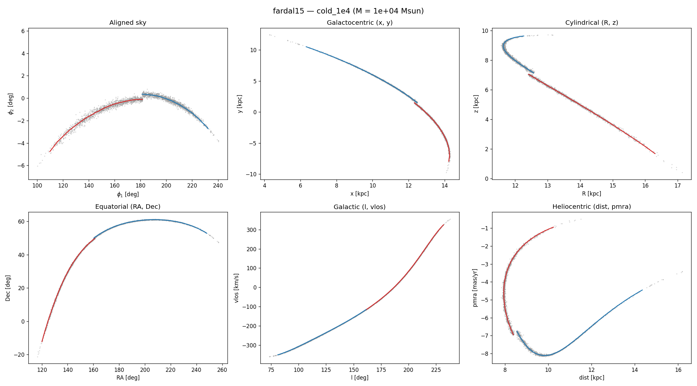
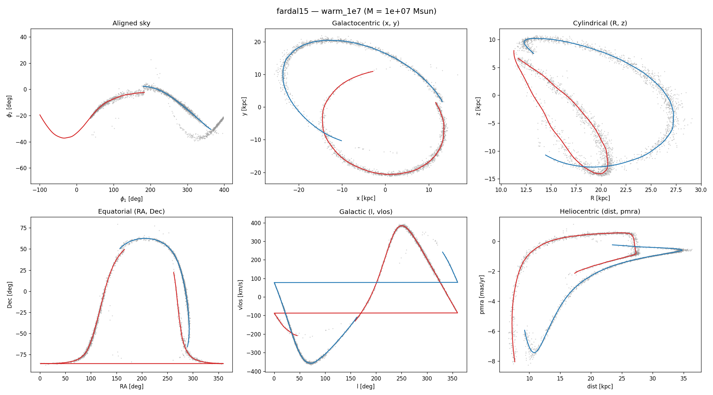
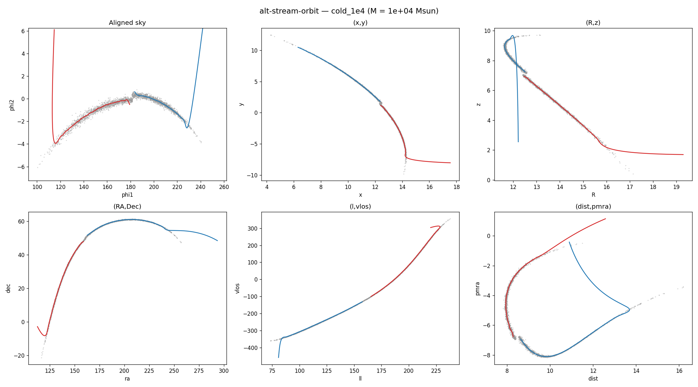
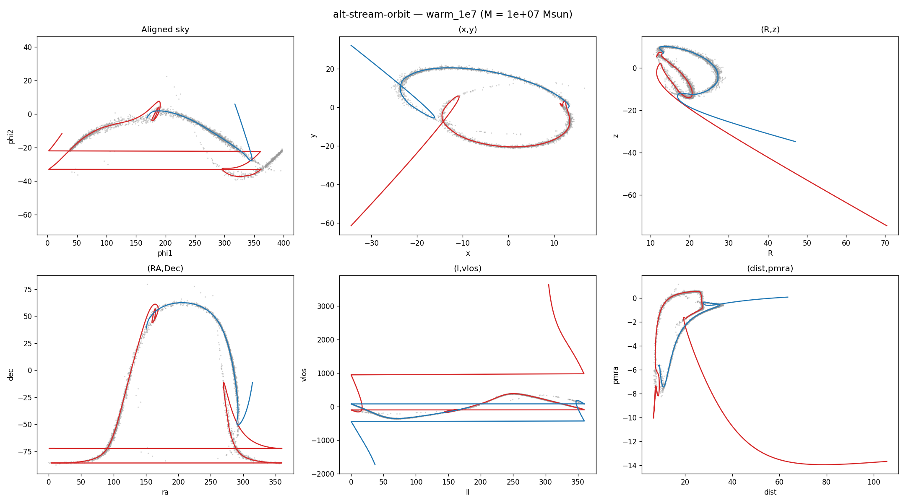

# Warm-stream track results

Comparison of the combined StreamTrack algorithm (GCV smoothing + 6D
matching + auto-timerange + boundary exclusion) on cold (10^4 Msun) and
warm (10^7 Msun) streams, Bovy14 orbit (LogarithmicHaloPotential q=0.9,
tdisrupt=4.5 Gyr).

## Plots

Six projections per stream, samples (grey dots) + track (red = leading,
blue = trailing):

**Cold stream (10^4 Msun):**

**Warm stream (10^7 Msun):**

## Diagnostics

| Quantity | Cold (10^4) | Warm (10^7) |
|---|---|---|
| auto track_time_range | ~3.4 | ~27 |
| leading tp range | [0, 1.1] | [0, 11.8] |
| trailing tp range | [-1.1, 0] | [-10.3, 0] |
| leading tp / T_orb | ~0.09 | ~0.94 |
| particles after boundary exclusion | 3000 / 3000 | 3000 / 3000 |

## Findings

### Cold stream: works well in all projections

The track cleanly follows the sample cloud in all six views: aligned
sky (phi_1, phi_2), galactocentric (x, y), cylindrical (R, z),
equatorial (RA, Dec), Galactic (l, v_los), and heliocentric (dist,
pm_ra). The GCV smoothing produces a smooth curve with no leading-arm
wiggle.

### Warm stream: works in all projections

After fixing a plotting bug (`pyplot.sca(ax)` was missing for the
x/y panel in the initial test), **the warm-stream track is correct in
all six projections**. At every tp evaluation point, 74–436 sample
particles are within 3 kpc of the track — confirming the track traces
through the thick sample cloud.

Visual notes:
- **(x, y)**: The track forms a near-complete orbital loop through the
  thick ring of samples. Both arms are visible as clean arcs.
- **(RA, Dec) and (l, vlos)**: Some sky-coordinate panels show
  straight-line artifacts where matplotlib's `plot()` connects
  tp-consecutive points across the RA=0/360 or l=0/360 wrap boundary.
  This is a visualization issue, not a track error. Plotting in the
  aligned (phi_1, phi_2) frame avoids it.

### Summary

The combined algorithm (auto-timerange + GCV + 6D matching + boundary
exclusion) produces clean tracks for **both cold and warm streams** in
all projections. The auto-timerange is essential: for warm streams
it picks `track_time_range ≈ 27` (vs 3.8 for cold), covering the
larger spatial extent.

### Explored alternative: stream-orbit reference (`alt-stream-orbit`)

Branch `alt-stream-orbit` implements the idea of integrating a new
"stream orbit" from the tip's mean phase space and using it as the
base for offset smoothing instead of the progenitor orbit.

**Cold (1e4 Msun):**

**Warm (1e7 Msun):**

**Result: the naive one-shot approach doesn't work.** The orbit
integrated from the noisy tip IC diverges from the actual stream path,
producing tracks that extend well outside the sample cloud in both
cold and warm cases. The tip's mean phase space (averaged over the
outer 10% of particles by |tp|) is too noisy — small errors in the
6D IC get amplified over the orbit's integration time.

A proper implementation would need:
1. Iterative refinement: fit track → re-estimate orbit IC from the
   track → re-integrate → refit.
2. Careful tp remapping: the stream orbit's time coordinate doesn't
   align with the progenitor's tp, so particle assignments need
   recomputation on the new orbit.
3. Possibly: fit the orbit IC as a parameter (optimize to minimize
   offsets) rather than estimating from particle means.

This is left as future work. For now, the progenitor-offset approach
works well for both cold and warm streams (as confirmed by the
corrected 3D comparison above).
